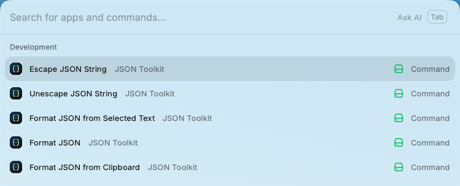
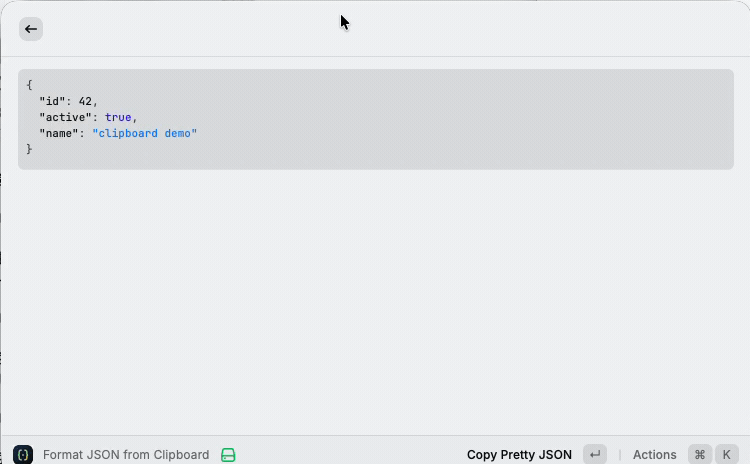
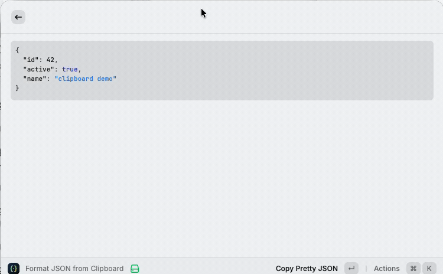
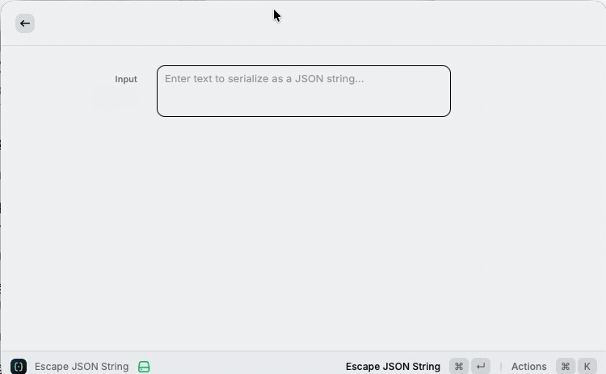

# JSON Toolkit for Raycast


Format JSON, clean up JSON-like logs, and escape or unescape JSON strings without leaving Raycast.

Everything runs inside Raycast. No browser formatter, terminal workflow, external editor, or network service is required after installation.



## See It in Action

### Format valid JSON



Paste JSON into Raycast and get a readable, pretty-formatted result immediately, with whole-result copy actions built in.

### Best-effort formatting for logs and relaxed JSON



If strict parsing fails, JSON Toolkit keeps surrounding text intact and only reformats balanced JSON-like spans conservatively.

### Unescape one JSON string layer, then format it



Decode exactly one JSON string layer and jump straight into formatted JSON when the unescaped text is JSON.

## What It Does

- Format JSON entered manually, copied to the clipboard, or selected in another app.
- Pretty-print any valid JSON root, including objects, arrays, primitives, and `null`.
- Preserve stringified JSON as a string instead of silently reinterpreting it.
- Best-effort format relaxed JSON-like text embedded in logs.
- Preserve single quotes, comments, unquoted keys, trailing commas, and surrounding text in fallback mode.
- Escape full text values as JSON strings.
- Unescape exactly one JSON string layer.
- Reject inputs larger than 5 MB before parsing or rendering.

## Commands

| Command                          | What it is for                                  |
| -------------------------------- | ----------------------------------------------- |
| `Format JSON`                    | Paste JSON, relaxed JSON, or log text manually  |
| `Format JSON from Selected Text` | Format the active selection from another app    |
| `Format JSON from Clipboard`     | Format the current text clipboard contents      |
| `Escape JSON String`             | Serialize plain text as a JSON string           |
| `Unescape JSON String`           | Decode one JSON string layer                    |

The input source commands are intentionally separate. If selected text is unavailable, the extension reports that state instead of silently falling back to the clipboard.

## Formatting Behavior

JSON Toolkit always tries strict `JSON.parse` first.

### Valid JSON

- Shows pretty JSON in a fenced `json` code block
- Supports `Copy Pretty JSON` with `Command-C`
- Supports `Copy Minified JSON` with `Command-Shift-C`

### Invalid or relaxed JSON

- Shows a concise `Invalid JSON · Best-effort formatting` notice
- Conservatively reformats balanced JSON-like fragments in place
- Preserves surrounding text and token spelling
- Does not invent missing quotes, commas, or delimiters
- Does not strip comments or normalize relaxed syntax into standard JSON

## Install Locally

Requirements:

- macOS with [Raycast](https://www.raycast.com/) installed
- Node.js `22.22.2` or newer
- npm
- GNU Make, optional but recommended

With Make:

```bash
make install
make local
```

Without Make:

```bash
npm install
npm run dev
```

## Development

```bash
make help        # List available commands
make test        # Run the Vitest suite
make test-watch  # Run tests in watch mode
make lint        # Run Raycast manifest, ESLint, and Prettier checks
make lint-fix    # Apply automatic lint and formatting fixes
make typecheck   # Run TypeScript checks
make build       # Build the production bundle locally
make check       # Run all automated checks
```

## Testing

The automated suite covers:

- Valid, primitive, and stringified JSON roots
- Invalid and relaxed JSON
- Embedded JSON-like spans inside logs
- Preservation of malformed or unsupported content
- Escape and one-layer unescape behavior
- Markdown fence safety
- UTF-8 size limits
- Large deterministic fixtures up to 5 MB

Run everything with:

```bash
make check
```

Before release, also verify all five commands manually inside Raycast, including selected text, clipboard flows, copy actions, and 5 MB edge cases.

## Contributing

Contributions are welcome.

1. Open an issue before making substantial user-visible changes.
2. Preserve the product invariants in [AGENTS.md](AGENTS.md).
3. Add or update tests for every behavior change.
4. Run `make check`.
5. Open a pull request with behavior notes and manual verification details.

## License

[MIT](LICENSE)
